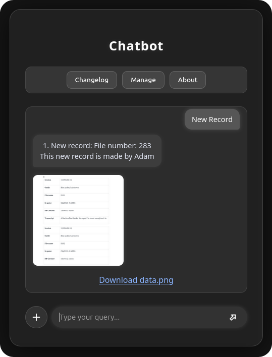
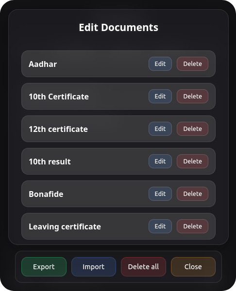

# User Documentation

This guide explains how to store, access, manage, back up, and restore your personal documents using **ChatBot**.


## 1. Store Personal Documents

1. Click the **➕ (Plus)** icon to open the **Add Document** menu.


2. Fill in the required details:

   * **Document Name**
   * **Document Number / Value** (optional)
   * **Additional Information** (optional)

3. You can also upload:

   * Photos
   * Videos
   * PDFs
   * Any type of document file

4. Click **Save** to securely store the document in your vault.

---

## 2. Access Stored Documents

1. To view or download a file, type the **document name** in the chat input box and send it.



2. ChatBot will:

   * Display the matching document
   * Show images directly in the chat
   * Provide a **download link** for files

3. To see **all stored documents**, type:

```
Show all
```

ChatBot will list every document currently stored in your vault.

---

## 3. Manage Stored Documents

1. Click the **Manage** button to open the document management menu.


2. The management menu allows you to:

   * Edit any document
   * Delete a specific document



3. To remove **all documents at once**, click the **Delete all** button.

---

## 4. Backup and Restore

### Export (Backup)

1. Click the **Export** button.
2. A **.json** backup file containing all your vault data will be downloaded automatically.


3. Store this file safely to restore your vault later if needed.

---

### Import (Restore)

1. Click the **Import** button.
2. Select the previously exported **.json** backup file.
3. All documents will be restored automatically with a real-time progress bar.


---

## Notes

* All data is stored **locally on your device**.
* No internet connection is required to use ChatBot.
* Your data never leaves your system unless you export it manually.

---

**Developed by Adityasinh Sodha**
